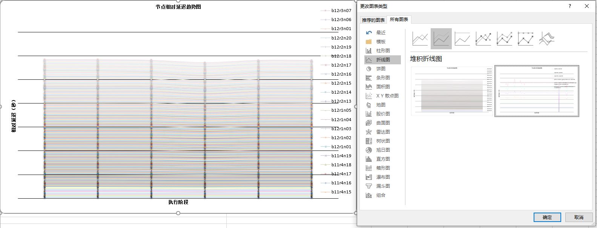

<!--
Copyright (c) 2026 Hygon Information Technology Co., Ltd.
SPDX-License-Identifier: Apache-2.0
-->

## 工具

### 训练前节点检查 (check.sh)

#### 简介

`check.sh` 是一个训练前节点检查脚本，使用 `fault_detection.py` 中的函数检查节点健康状态，确保训练开始前节点处于正常工作状态。

**级联检查模式**：仅对健康节点执行后续检查。每一步检查后，故障节点会被过滤掉，只有健康节点会进入下一轮检查。

#### 使用方法

```bash
./check.sh -f <hostfile> [OPTIONS]
```

#### 参数说明

| 参数 | 说明 | 默认值 |
|------|------|--------|
| `-f, --hostfile <file>` | 必选：指定待检查节点的 hostfile 路径 | - |
| `-t, --timeout <seconds>` | 可选：检查超时时间（秒） | 300 |
| `-o, --output <dir>` | 可选：结果输出目录 | ./check_results |
| `-h, --help` | 显示帮助信息 | - |

#### 跳过检查选项（默认执行所有检查）

| 参数 | 说明 |
|------|------|
| `--skip-nhc` | 跳过 NHC 检查 |
| `--skip-hcu` | 跳过 HCU 信息检查 |
| `--skip-mem` | 跳过内存信息检查 |

#### 检查类型（按执行顺序）

1. **sinfo -R 检查**（始终执行）：通过 `check_sinfo_R()` 函数检查节点状态，作为第一道筛选
2. **NHC 检查**（默认执行）：通过 `run_nhc()` 函数执行节点健康检查
3. **HCU 信息检查**（默认执行）：通过 `get_hcu_info()` 函数获取 HCU 卡信息
4. **内存信息检查**（默认执行）：通过 `get_mem_info()` 函数获取内存使用情况

#### 使用示例

```bash
# 默认执行所有检查
./check.sh -f /path/to/hostfile

# 仅执行 NHC 检查
./check.sh -f /path/to/hostfile --skip-hcu --skip-mem

# 自定义超时和输出目录
./check.sh -f /path/to/hostfile -t 600 -o /path/to/output
```

#### 输出文件

- `healthy_nodes.txt`：健康节点列表
- `fault_nodes.txt`：异常节点列表
- `check_<timestamp>.log`：检查日志

---

### 时间戳解析

#### 步骤1：前置条件

```
通过以下命令获取指定分支的 hcu_megatron 代码：
git clone https://github.com/your-org/hcu-megatron.git -b hcu_megatron_timestamp_analysis

获取的 hcu_megatron 代码已内置统一的时间戳打点机制，无需用户手动插桩。
基于该代码完成一次完整的训练流程后，将自动生成包含时间戳信息的训练日志；
时间戳解析工具以该训练过程中产生的日志文件作为输入。
```

#### 步骤2：启动方式

```bash
python extract.py \
  --input_file /path/to/out.log \
  --dir /path/to/your/project/ \
  --filter_threshold 1 \
  --num_nodes 1000 \
  --slow_threshold 1
```

系统支持用户进行手动时间戳插桩，但插桩日志必须遵循既定的时间戳格式规范。`training_timestamp 【{timestamp}】 start128 host:{hostname}`

- --start_slogan 用于识别手动插桩的时间戳日志行。默认是'training_timestamp'
- --lt 时间戳的左分隔符，默认是'【' 
- --gt 时间戳的右分隔符，默认是'】' 
- --dir 指定待解析的代码目录。程序将在该目录中搜索相关代码，以确定替换时间戳中的阶段名；不作为输出路径使用。
- --input_file 指定包含时间戳信息的训练日志文件，作为时间戳解析与阶段分析的输入数据源。
- --filter_threshold 用于过滤阶段耗时低于该阈值的记录，仅保留延迟超过阈值的阶段，用于后续分析。（单位：s）
- --num_nodes 指定 `--input_file` 中训练日志所涉及的节点数量，用于多节点场景下的阶段统计与分析。
- --slow_threshold 用于筛选慢阶段，只统计超过该值的慢阶段（单位：s）

#### 步骤3：更改图标类型

生成的 Excel 文件中，第二个 Sheet（“阈值过滤结果”）默认采用第一种堆积折线图展示。为提升结果的可读性，需要将该图表调整为第二种堆积折线图格式，以便更直观地观察和分析结果。



---

## 节点健康检测工具 (run_node_check.sh)

### 概述

`run_node_check.sh` 是一个用于大规模集群节点健康状态检测的脚本工具。通过**两阶段分组测试策略**（横向 + 纵向），高效识别集群中的故障节点，支持大规模分布式训练前的节点预检。

### 核心特性

- **两阶段检测策略**：横向分组 + 纵向分组，通过交集定位故障节点
- **并行执行**：多组测试并行运行，大幅缩短检测时间
- **灵活配置**：支持多种分组规模，TFLOPs阈值可自定义
- **性能基准验证**：基于 TFLOPs 指标判断节点健康状态
- **自动报告生成**：输出健康/故障节点列表及详细诊断报告

### 使用方法

#### 参数说明

| 参数 | 短选项 | 长选项 | 必选 | 默认值 | 说明 |
|------|--------|--------|------|--------|------|
| 节点文件 | `-c` | `--clushnode` | ✅ | - | 待检测节点列表文件 |
| 分组数量 | `-n` | `--nodenum` | ❌ | 4 | 每组节点数 |
| TFLOPs阈值 | `-t` | `--tflops` | ❌ | 100 | 性能基准阈值 |
| 健康节点路径 | `-g` | `--healthy` | ❌ | `./node_checklog/host_check_pass` | 健康节点保存路径 |
| 故障节点路径 | `-f` | `--fault` | ❌ | `./node_checklog/host_check_error` | 异常节点保存路径 |
| 仅横向检测 | `-o` | `--only-horizontal` | ❌ | 否 | 仅执行横向检测，跳过纵向检测 |
| 帮助 | `-h` | `--help` | - | - | 显示帮助信息 |

#### 使用示例

##### 模式1：简化位置参数（推荐快速使用）

```bash
# 检测 clushnode 文件中的节点，每组 4 个节点
./run_node_check.sh ./clushnode 4

# 检测 clushnode 文件中的节点，每组 8 个节点
./run_node_check.sh ./clushnode 8
```

##### 模式2：完整选项参数

```bash
# 完整参数示例
./run_node_check.sh -c ./clushnode -n 4 -g ./healthy_nodes.txt -f ./fault_nodes.txt

# 仅执行横向检测
./run_node_check.sh -c ./clushnode -n 4 --only-horizontal

# 显示帮助信息
./run_node_check.sh -h
```

### 工作原理

#### 两阶段检测策略

以 **32 节点、每组 4 节点** 为例：

```
节点列表: [N1, N2, N3, ..., N32]（共 32 个节点）

┌─────────────────────────────────────────────────────────────┐
│                    Phase 1: 横向分组测试                      │
├─────────────────────────────────────────────────────────────┤
│  将节点按顺序分组，每组 4 个节点，共 8 组：                    │
│                                                              │
│  H1:  [N1,  N2,  N3,  N4 ]  ──测试──> PASS/FAIL             │
│  H2:  [N5,  N6,  N7,  N8 ]  ──测试──> PASS/FAIL             │
│  H3:  [N9,  N10, N11, N12]  ──测试──> PASS/FAIL             │
│  H4:  [N13, N14, N15, N16]  ──测试──> PASS/FAIL             │
│  H5:  [N17, N18, N19, N20]  ──测试──> PASS/FAIL             │
│  H6:  [N21, N22, N23, N24]  ──测试──> PASS/FAIL             │
│  H7:  [N25, N26, N27, N28]  ──测试──> PASS/FAIL             │
│  H8:  [N29, N30, N31, N32]  ──测试──> PASS/FAIL             │
└─────────────────────────────────────────────────────────────┘
                           ↓
┌─────────────────────────────────────────────────────────────┐
│                    Phase 2: 纵向分组测试                      │
├─────────────────────────────────────────────────────────────┤
│  从每个横向组中各取 1 个节点，组成纵向组，共 8 组，每组 4 节点：│
│                                                              │
│  V1:  [N1,  N5,  N9,  N13]  ──测试──> PASS/FAIL             │
│  V2:  [N2,  N6,  N10, N14]  ──测试──> PASS/FAIL             │
│  V3:  [N3,  N7,  N11, N15]  ──测试──> PASS/FAIL             │
│  V4:  [N4,  N8,  N12, N16]  ──测试──> PASS/FAIL             │
│  V5:  [N17, N21, N25, N29]  ──测试──> PASS/FAIL             │
│  V6:  [N18, N22, N26, N30]  ──测试──> PASS/FAIL             │
│  V7:  [N19, N23, N27, N31]  ──测试──> PASS/FAIL             │
│  V8:  [N20, N24, N28, N32]  ──测试──> PASS/FAIL             │
└─────────────────────────────────────────────────────────────┘
                           ↓
┌─────────────────────────────────────────────────────────────┐
│                    故障节点定位                               │
├─────────────────────────────────────────────────────────────┤
│  横向失败节点 ∩ 纵向失败节点 = 故障节点                        │
│                                                              │
│  例如: H2 FAIL (含 N6) + V2 FAIL (含 N6) → N6 故障           │
│                                                              │
│  原理：若某节点故障，其所在的横向组和纵向组都会测试失败        │
│        通过求交集可精确定位故障节点                           │
└─────────────────────────────────────────────────────────────┘
```

### 性能基准

默认 TFLOPs 阈值为 **100**，可通过 `-t` 或 `--tflops` 参数自定义。

```bash
# 使用默认阈值 100
./run_node_check.sh -c ./clushnode -n 4

# 自定义阈值为 200
./run_node_check.sh -c ./clushnode -n 4 -t 200
```

> 注：实际基准值可能因硬件配置不同而有所差异，请根据实际情况通过 `-t` 参数调整。

### 输出说明

#### 1. 控制台输出

脚本执行过程中会实时输出测试状态：

```
========== Phase 1: Horizontal Group Testing ==========
Creating horizontal group H1: nodes 1-4
Creating horizontal group H2: nodes 5-8
...

Analyzing horizontal group results...
[PASS] Horizontal group H1 [node1,node2,node3,node4]: 190.5 TFLOPs
[FAIL] Horizontal group H2 [node5,node6,node7,node8]: 150.2 TFLOPs < 185 TFLOPs
```

#### 2. 结果文件

| 文件 | 说明 |
|------|------|
| `host_check_pass` | 健康节点列表 |
| `host_check_error` | 故障节点列表 |
| `diagnosis_report.txt` | 详细诊断报告 |

#### 3. 诊断报告示例

```
Dual-Stage Fault Diagnosis Report
Test Time: 2026-04-14 11:30:00
Total Nodes: 128
Nodes Participating in Test: 128
Nodes Per Group: 4
Baseline TFLOPs: 185

Phase 1 - Horizontal Groups:
  Total Groups: 32
  Failed Groups: 2 5 8

Phase 2 - Vertical Groups:
  Total Groups: 32
  Failed Groups: 3 7

Fault Nodes (Intersection):
  node42
  node86

Diagnosis Conclusion:
Faulty nodes detected,建议驱逐
```

### 配置说明

在首次使用前，需要根据实际环境修改 `check_nodes.sh` 脚本中的配置变量：

```bash
# 配置文件路径
cluster_manager/node_check/check_nodes.sh
```

#### 需要修改的配置项

打开 `check_nodes.sh`，找到以下配置变量并根据实际环境修改：

| 配置项 | 说明 | 示例值 |
|--------|------|--------|
| `MEGATRON_PATH` | Megatron-LM 安装路径 | `/public/home/user/hcu_megatron` |
| `TRAIN_PATH` | 训练脚本路径 | `${MEGATRON_PATH}/examples/gpt3` |
| `DATA_PATH` | 数据集路径 (redpajama_text_document) | `/path/to/redpajama_text_document` |
| `TOKENIZER_MODEL_PATH` | Tokenizer 模型路径 | `/path/to/tokenizer.model` |
| `CHECKPOINT_PATH` | Checkpoint 保存路径 | `./ckpt` |
| `DTK_ENV` | DTK 环境脚本路径（可选） | `""` |
| `NCCL_ENV` | NCCL 环境脚本路径 | `${MEGATRON_PATH}/requirements/env.sh` |
| `LAUNCH_WITH_BINDING` | Launch with binding 脚本路径 | `${MEGATRON_PATH}/requirements/launch_with_binding.sh` |
| `CONDA_INIT_PATH` | Conda 初始化脚本路径 | `/path/to/anaconda3/etc/profile.d/conda.sh` |
| `CONDA_ENV` | Conda 环境名称 | `cluster_manager` |
| `TRAIN_SCRIPT` | 训练脚本路径（自动生成） | `${TRAIN_PATH}/train_gpt_567B_*nodes.sh` |

### 依赖要求

#### 软件依赖

- **MPI 环境**：需要加载 `mpi/hpcx/2.18.0/gcc-8.5.0/shca` 模块
- **Conda 环境**：`cluster_manager`

#### 文件依赖

- `check_nodes.sh`：单组节点测试脚本（位于 `cluster_manager/node_check/`）
- 训练脚本：`train_gpt_567B_*nodes.sh`（位于 `TRAIN_PATH` 目录下）
- 数据集路径和 tokenizer 模型路径

### 节点列表文件格式

`clushnode` 文件格式（每行一个节点名）：

```
node001
node002
node003
...
```

### 注意事项

1. **执行权限**：确保脚本有执行权限
   ```bash
   chmod +x run_node_check.sh
   ```

2. **路径配置**：首次使用前必须修改 `cluster_manager/node_check/check_nodes.sh` 中的以下配置项：
   - `MEGATRON_PATH`：Megatron-LM 路径
   - `DATA_PATH`：数据集路径
   - `TOKENIZER_MODEL_PATH`：Tokenizer 模型路径
   - `NCCL_ENV`：NCCL 环境脚本路径
   - `CONDA_INIT_PATH`：Conda 初始化脚本路径
   - `CONDA_ENV`：Conda 环境名称

3. **资源占用**：测试过程会占用 GPU 资源，请确保节点空闲

4. **测试时间**：大规模节点检测可能需要较长时间，建议在后台运行

### 故障排查

#### 常见问题

| 问题 | 可能原因 | 解决方案 |
|------|----------|----------|
| `Test failed or no output` | MPI 启动失败或训练脚本错误 | 检查 `node_checklog/` 下的日志文件 |
| TFLOPs 持续偏低 | 基准值设置过高 | 使用 `-t` 参数降低阈值 |

#### 日志位置

- 横向测试日志：`./node_checklog/horizontal_H*.log`
- 纵向测试日志：`./node_checklog/vertical_V*.log`

---

## 网络拓扑验证工具 (run_net_topology.sh)

### 概述

`run_net_topology.sh` 用于验证分布式训练的网络拓扑配置，确保节点间通信正常。该工具通过 mpirun 启动分布式进程，验证 TP/PP/DP/CP 等并行配置的正确性，并可选地运行通信性能基准测试。

### 核心功能

- **拓扑验证**：验证分布式训练的网络拓扑配置是否正确
- **自动参数解析**：支持从训练脚本自动解析 TP/PP/DP 等并行参数
- **通信基准测试**：可选运行通信性能基准测试，评估节点间通信带宽
- **详细日志输出**：支持详细模式输出调试信息

### 使用方法

```bash
./run_net_topology.sh <hostfile_path>
```

### 命令行参数

| 参数 | 必选 | 说明 |
|------|------|------|
| `hostfile_path` | ✅ | hostfile 文件路径，包含参与测试的节点列表 |

### 使用示例

```bash
# 使用绝对路径
./run_net_topology.sh /path/to/hostfile

# 使用相对路径
./run_net_topology.sh ./hostfile
```

### 配置变量说明

脚本内部包含以下配置变量，使用前需要根据实际环境修改：

#### 并行参数配置

| 变量名 | 默认值 | 说明 |
|--------|--------|------|
| `MEGATRON_SCRIPT_PATH` | 训练脚本路径 | 方式1：从训练脚本自动解析并行参数（推荐） |
| `TP_SIZE` | `8` | Tensor Parallelism 大小（方式2：手动指定） |
| `PP_SIZE` | `2` | Pipeline Parallelism 大小（方式2：手动指定） |
| `DP_SIZE` | `1` | Data Parallelism 大小（方式2：手动指定） |
| `CP_SIZE` | `1` | Context Parallelism 大小（方式2：手动指定） |
| `EP_SIZE` | `1` | Expert Parallelism 大小（MoE 模型专用） |
| `ETP_SIZE` | `1` | Expert Tensor Parallelism 大小（MoE 模型专用） |

> **注意**：
> - 方式1（推荐）：设置 `MEGATRON_SCRIPT_PATH` 后，将自动从训练脚本解析并行参数，无需手动设置 TP/PP/DP 等
> - 方式2：将 `MEGATRON_SCRIPT_PATH` 设为空，使用手动指定的参数
> - 约束条件：`TP_SIZE × PP_SIZE × DP_SIZE × CP_SIZE` 必须等于 `NUM_PROCESSES`

#### 环境配置

| 变量名 | 说明 | 示例值 |
|--------|------|--------|
| `NCCL_ENV` | NCCL 环境脚本路径 | `/path/to/requirements/env.sh` |
| `CONDA_INIT_PATH` | Conda 初始化脚本路径 | `/path/to/anaconda3/etc/profile.d/conda.sh` |
| `CONDA_ENV` | Conda 环境名称 | `megatron_fla042_mhc_tilelang` |

#### 输出配置

| 变量名 | 默认值 | 说明 |
|--------|--------|------|
| `OUTPUT_DIR` | `./topology_results` | 输出目录，用于保存验证结果 |

#### 基准测试配置

| 变量名 | 默认值 | 说明 |
|--------|--------|------|
| `RUN_BENCHMARK` | `true` | 是否运行通信性能基准测试 |
| `BENCHMARK_ITERATIONS` | `10` | 基准测试迭代次数 |
| `BENCHMARK_DATA_SIZE_MB` | `1.0` | 基准测试数据大小（MB） |

#### 其他配置

| 变量名 | 默认值 | 说明 |
|--------|--------|------|
| `VERBOSE` | `false` | 是否输出详细日志 |

### 配置示例

打开 `run_net_topology.sh`，修改以下配置变量：

```bash
# 方式1：从训练脚本自动解析（推荐）
MEGATRON_SCRIPT_PATH="/path/to/train_glm5_70b.sh"

# 方式2：手动指定并行参数
MEGATRON_SCRIPT_PATH=""  # 设为空
TP_SIZE=8
PP_SIZE=2
DP_SIZE=1
CP_SIZE=1

# 环境配置
NCCL_ENV="/path/to/requirements/env.sh"
CONDA_INIT_PATH="/path/to/anaconda3/etc/profile.d/conda.sh"
CONDA_ENV="your_conda_env"

# 输出目录
OUTPUT_DIR="./topology_results"

# 基准测试配置
RUN_BENCHMARK=true
BENCHMARK_ITERATIONS=10
BENCHMARK_DATA_SIZE_MB=1.0
```

### Hostfile 格式

`hostfile` 文件格式（每行一个节点名，可选指定 slots 数）：

```
node001 slots=8
node002 slots=8
node003 slots=8
```

### 输出说明

#### 控制台输出

脚本执行过程中会输出配置信息和验证结果：

```
Network Topology Validator
Hostfile:         ./hostfile
Num Processes:    16
Output Dir:       ./topology_results
Mode:             Parse from training script
Train Script:     /path/to/train_glm5_70b.sh

[INFO] Starting topology validation...

✓ Topology validation completed successfully
```

#### 输出文件

结果保存在 `OUTPUT_DIR` 指定的目录下：

| 文件 | 说明 |
|------|------|
| `topology_results/` | 验证结果目录 |
| `topology_results/validation_report.json` | 验证报告（JSON 格式） |
| `topology_results/benchmark_results.json` | 基准测试结果（如果启用） |

### 依赖要求

#### 软件依赖

- **MPI 环境**：需要 `mpirun` 命令可用
- **Python 环境**：需要 Python 3.x
- **Conda 环境**：由 `CONDA_ENV` 指定

#### 文件依赖

- `cluster_manager/parallel/net_topology_validator.py`：Python 验证脚本
- 训练脚本（如果使用方式1）：由 `MEGATRON_SCRIPT_PATH` 指定
- NCCL 环境脚本：由 `NCCL_ENV` 指定

### 注意事项

1. **执行权限**：确保脚本有执行权限
   ```bash
   chmod +x run_net_topology.sh
   ```

2. **路径配置**：首次使用前必须修改以下配置项：
   - `MEGATRON_SCRIPT_PATH` 或手动设置 TP/PP/DP 参数
   - `NCCL_ENV`：NCCL 环境脚本路径
   - `CONDA_INIT_PATH`：Conda 初始化脚本路径
   - `CONDA_ENV`：Conda 环境名称

3. **并行参数约束**：确保 `TP_SIZE × PP_SIZE × DP_SIZE × CP_SIZE = NUM_PROCESSES`

4. **资源占用**：测试过程会占用所有节点的 GPU 资源，请确保节点空闲

5. **网络配置**：确保节点间可以通过 SSH 免密通信

### 故障排查

#### 常见问题

| 问题 | 可能原因 | 解决方案 |
|------|----------|----------|
| `hostfile 不存在` | hostfile 路径错误 | 检查 hostfile 路径是否正确 |
| `MPI 启动失败` | SSH 免密未配置 | 配置节点间 SSH 免密登录 |
| `Python 脚本找不到` | 路径配置错误 | 检查 `PROJECT_ROOT` 路径是否正确 |
| `Conda 环境不存在` | 环境名称错误 | 检查 `CONDA_ENV` 配置 |

#### 调试模式

启用详细输出以获取更多调试信息：

```bash
# 在脚本中设置
VERBOSE=true
```
